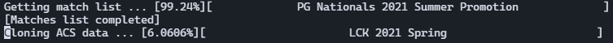

# lol-api-project

A project to learn how to work with data, using the **Leaguepedia &amp; Riot APIs**.

The current goal of it is to store every match history for competitive games of season 11. To do so, the first step is getting every competitive match "match history link" from Leaguepedia to build requests with the matches ID on the Riot ACS API and put the results in a MongoDB database.

This project is personal & educational : I'm using this as a way to learn how retrieving and processing data in Python/MongoDB.

## __Required modules__

* Pymongo (be sure that MongoDB is installed and started!)
* MWClient
* JSON and simpleJSOn modules 
*You can install them with `pip install pymongo` and `pip install mwclient`*, etc.

## __How to use ?__

The first step is to get a connection cookie to the League of Legends website,to be able to request things on the API. You must paste the cookie in a "cookies.txt" file in the folder. See the "How to get a cookie ?" section for more informations.

To run the program, just execute `python3 main.py` in a shell.

Several files are created when executed : 
 
* "response_error_log.txt" : every request that didn't work with URL
* "url_error_log.txt" : every non correct URL (URL without game hash or LPL Match History links)

## __How to get a connection cookie ?__

To get a cookie, first sign-in on the League of Legends website with your Riot account. Next, visit an ACS URL (such as : https://acs.leagueoflegends.com/v1/stats/game/ESPORTSTMNT06/1070986?gameHash=1787d1ea36a382c3).

Use the "Inspect the element" tool, to search in the Network tab for a "Cookie" field, and copy the value in a "cookies.txt" file in the folder.