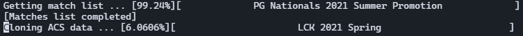

# CloneACS

*Cloning competitive matches before the ACS API disappears*

## __What is CloneACS ?__

CloneACS is a small program that uses the **Leaguepedia** and **Riot APIs**, to clone every League of Legends competitive matches from season 11 on the **ACS API**, into a MongoDB database. It first requests the match list on the Leaguepedia API and then uses "match history" links to request matches statistics and timelines on the **ACS API**.

*This project is personal & educational : I'm using this as a way to learn how retrieving and processing data in Python/MongoDB. Therefore, there could be issues and mistakes in my code*

## __Required modules__

* Pymongo (be sure that MongoDB is installed and started!)
* MWClient
* JSON and simpleJSON modules 
*You can install them with `pip install pymongo` and `pip install mwclient`*, etc.

## __How to use ?__

The first step is to get a connection cookie to the League of Legends website,to be able to request things on the API. You must paste the cookie in a "cookies.txt" file in the folder. See the "How to get a cookie ?" section for more informations.

To run the program, just execute `python3 main.py` in a shell.

Several files are created when executed : 
 
* "failed_requests.log" : every request that didn't work with URL
* "incorrect_urls.log" : every non correct URL (URL without game hash or LPL Match History links)

## __How to get a connection cookie ?__

To get a cookie, first sign-in on the League of Legends website with your Riot account. Next, visit an ACS URL (such as : https://acs.leagueoflegends.com/v1/stats/game/ESPORTSTMNT06/1070986?gameHash=1787d1ea36a382c3).

Use the "Inspect the element" tool, to search in the Network tab for a "Cookie" field, and copy the value in a "cookies.txt" file in the folder.

## __Known Issues__

Even after 15 requests, the ACS API is unstable and tends to time-out sometimes : the URLs that didn't work are not treated and you can find them in the "failed_requests.log" file created once the program is executed.

## __Questions__

If you have any question, feel free to contact me here : mailletwil@gmail.com
